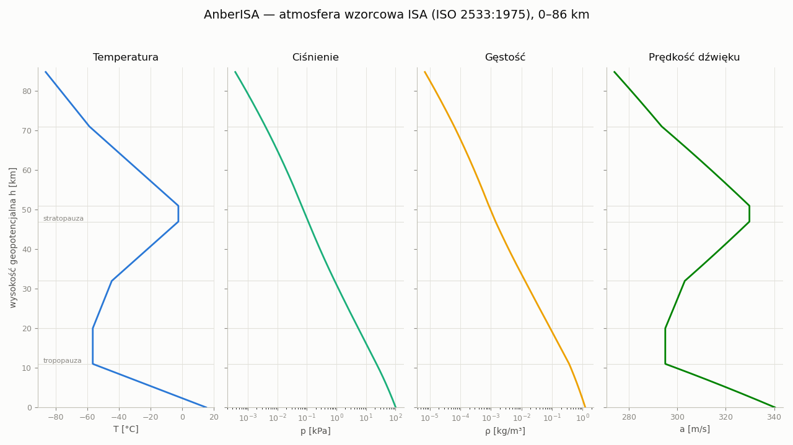

# AnberISA — atmosfera wzorcowa ISA na Anbernic RG40XX V

[](https://github.com/karolfurtak/AnberISA/actions/workflows/ci.yml)

Kalkulator **atmosfery wzorcowej ISA** (ISO 2533:1975 / ICAO Doc 7488/3 /
US Standard Atmosphere 1976) w trzech postaciach:

- **`isa_lib`** — samodzielna, importowalna biblioteka Pythona (czysty stdlib, zero zależności),
- **`main.py`** — interaktywna aplikacja SDL2 na handheld **Anbernic RG40XX V** (640×480, sterowanie padem),
- **`atmo.py`** — frontend CLI (punkt / tabela / wykres / inwersja).



*Wykres wygenerowany headless (matplotlib Agg) bezpośrednio z `isa_lib` — profil
T, p, ρ i a w pełnym zakresie modelu 0–86 km.*

## Fizyka

Model warstwowy ISA: w każdej warstwie liniowy gradient temperatury
`T(h) = T_b + L·(h − h_b)`, ciśnienie z całki równania hydrostatyki
(wykładnicze dla `L = 0`, potęgowe dla `L ≠ 0`), gęstość z równania stanu gazu
doskonałego, prędkość dźwięku `a = √(γRT)`, lepkość dynamiczna z formuły
Sutherlanda, konwersja wysokości geometrycznej ↔ geopotencjalnej.

| Warstwa | h_geo [m]       | Gradient L [K/km] | Charakter         |
|---------|-----------------|-------------------|-------------------|
| 0       | 0 – 11 000      | −6,5              | troposfera        |
| 1       | 11 000 – 20 000 | 0                 | tropopauza        |
| 2       | 20 000 – 32 000 | +1,0              | stratosfera dolna |
| 3       | 32 000 – 47 000 | +2,8              | stratosfera górna |
| 4       | 47 000 – 51 000 | 0                 | stratopauza       |
| 5       | 51 000 – 71 000 | −2,8              | mezosfera dolna   |
| 6       | 71 000 – 84 852 | −2,0              | mezosfera górna   |

Górny limit: **84 852 m geopotencjalnie ≈ 86 km geometrycznie**.
Obsługiwane odchyłki od warunków wzorcowych: `ΔT` (np. ISA+15, gorący dzień).

## Funkcje

**Aplikacja na konsoli** (SDL2 + evdev, ekrany MENU → PUNKT / TABELA / WYKRES /
INWERSJA / NORMY):
- obliczenia punktowe z wyborem jednostek (m/ft/km; hPa/Pa/mmHg/inHg),
- tabele z zapisem CSV,
- wykresy profili na ekranie konsoli,
- inwersje: wysokość ciśnieniowa i gęstościowa, z **generowaniem raportu PDF**
  z rozpisanymi obliczeniami (`raport.py`),
- przegląd norm (NORMY),
- mapowanie przycisków per-ekran — patrz [`KEYS.md`](KEYS.md).

**Biblioteka `isa_lib`:**

```python
from isa_lib import isa, pressure_altitude, density_altitude

r = isa(11000)                          # h_geo w metrach
print(r["T_K"], r["p_Pa"], r["rho_kg_m3"], r["a_m_s"])
# 216.65 22632.06 0.36392 295.069

r = isa(35000, unit_h="ft", dT=15)      # FL350, ISA+15
r = isa([0, 5000, 11000, 20000])        # iterable -> lista dictów

h_p = pressure_altitude(70000)          # 3012.18 m
h_rho = density_altitude(0.9)           # 3097.82 m
```

Zwracany dict: `h_geo_m`, `h_geom_m`, `T_K`, `p_Pa`, `rho_kg_m3`, `a_m_s`,
`mu_Pa_s` (Sutherland), `nu_m2_s`, `sigma`, `delta`, `theta`, `layer`.

**CLI `atmo.py`:**

```bash
python3 atmo.py point -H 11000
python3 atmo.py point -H 35000 --unit ft --dT 20
python3 atmo.py table --h0 0 --h1 20000 --step 1000 --csv tabela.csv
python3 atmo.py plot  --h0 0 --h1 50000 --n 400 --out wykresy/profil.png
python3 atmo.py invert --p 70000
python3 atmo.py invert --rho 1.0 --dT 30
```

Przykładowe wykresy z CLI: katalog [`wykresy/`](wykresy/).

## Struktura

```
isa_lib/              # biblioteka (czysty stdlib)
├── __init__.py       # publiczne API
├── constants.py      # stałe ICAO, warstwy 0..86 km
└── core.py           # isa(), pressure_altitude(), density_altitude()
main.py               # aplikacja SDL2 na RG40XX V
power_screen.py       # obsługa przycisku POWER / wygaszania ekranu
atmo.py               # frontend CLI
raport.py             # generator raportu PDF (inwersja)
tests/test_isa.py     # 38 testów pytest
wykresy/              # przykładowe wykresy .png
```

## Uruchomienie

**Na konsoli (Anbernic RG40XX V, stock firmware z Pythonem 3):** skopiuj katalog
do `/mnt/mmc/Roms/APPS/anberisa/` i odpal z menu aplikacji. Wymaga `pysdl2`
(SDL2 w `/usr/lib`), `Pillow`, opcjonalnie `matplotlib` (ekran WYKRES)
i fontu DejaVu Sans Mono.

**Na PC (CLI i biblioteka):** czysty Python ≥ 3.10; do `plot` potrzebne
`numpy` + `matplotlib`.

## Testy

```bash
python3 -m pytest tests/ -v
# 38 passed
```

Pokrycie: 13 punktów z tablic ICAO Doc 7488 (tolerancja 0,5 %), 8 granic warstw
(T do 0,001 K), konwersje geopot. ↔ geom., jednostki, offset ISA+dT, formuły
pomocnicze (a, ρ, Sutherland), round-trip wysokość → p/ρ → wysokość, przypadek
wysokości gęstościowej lotniska, limity zakresu (h<0, h>86 km).

CI (GitHub Actions, badge powyżej) uruchamia pełny zestaw na Pythonie 3.11.
